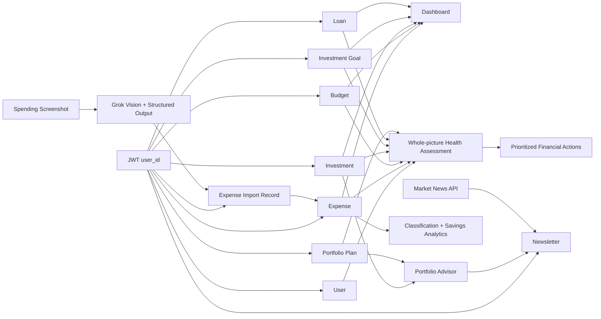

# Architecture

## Request path

1. `requestLogger` assigns or propagates an `X-Request-Id` and emits redacted structured logs.
2. Helmet, CORS, rate limiting, compression, the 1 MB JSON parser, and Mongo sanitization protect the request boundary.
3. The same Express service delivers the static browser application, public liveness/readiness/documentation, and the optional rate-limited demo-session endpoint before authentication.
4. `authenticate` verifies an HS256 JWT and places its string `user_id` claim on the request.
5. Route controllers normalize input and always scope database operations to that `user_id`.
6. Finance services aggregate MongoDB data; market services use a bounded, cached provider client.
7. The error handler maps expected validation/database failures to safe responses and reports unexpected failures using structured logs and optional Sentry capture.

## Finance data

`user_id` is an external identity key rather than a MongoDB reference. This keeps the module independent of the identity provider while requiring every query to enforce user scoping.

## Screenshot privacy and automatic logging

Screenshot bytes are held in server memory while they are sent to the configured Grok vision model on xAI. The server stores a SHA-256 duplicate-detection hash, a short transaction preview, and parsed import items—not the original image. Extracted items are automatically classified and written to expense history during the upload request. The resulting expense IDs are returned so the website can offer optional category, amount, merchant, description, date, or necessity-type corrections through `PATCH /expenses/:id`.

## Allocation engine

The engine begins with a conservative, balanced, or growth base allocation. It then applies auditable adjustments for:

- investment horizon;
- age and dependents;
- income stability and monthly surplus;
- investment experience;
- emergency-fund coverage;
- health/term-insurance answers; and
- land/real-estate preference and liquidity eligibility.

The final normalization step guarantees that all six target percentages total exactly 100%. Current investment types are mapped into the same buckets for a target-versus-current view. Unknown asset types are reported as unmapped rather than silently assigned.

## Whole-picture assessment

The financial-health assessment reads every user-scoped finance domain in parallel. It scores cash flow, emergency readiness, debt load, spending control, goal progress, and portfolio alignment, then applies documented weights to produce a 0–100 score. Recommendations are ordered by urgency and include a reason and, where supported by the data, a suggested monthly amount. Missing inputs reduce data completeness and produce setup actions instead of invented assumptions.

The advisor remains deterministic: the same stored financial picture produces the same recommendations. It does not execute trades, predict returns, or use market headlines to change the long-term target.

## Frontend and deployment

The browser application is three static files served by Express from `public/`. It uses same-origin authenticated API requests, session-only token storage, accessible native dialogs, responsive layouts, and no CDN or frontend runtime dependency. Docker and Render therefore deploy one artifact for the UI and API, avoiding a second build pipeline and a second `node_modules` tree.

## Newsletter lifecycle

The newsletter key is the UTC date. A unique `(user_id, newsletterKey)` index prevents duplicates. The first request of the day combines saved plan data, current holdings, allocation flags, and cached relevant headlines. Subsequent website loads return the saved record. `readAt` controls the `shouldDisplay` response field.
